Efforts are underway to include table comments as part of the connection information so that it is available in tables & worksheets in ThoughtSpot. While that is in development, here is a process that accomplishes the same end goal using ThoughtSpot Modeling Language (TML), REST APIs, and the ThoughtSpot UI.

# Requirements
- [Active Databricks connection in ThoughtSpot](https://docs.thoughtspot.com/cloud/latest/connections-databricks-add)
- [Python 3.9+](https://www.python.org/downloads/release/python-390/)
- [thoughtspot_rest_api_v1](https://github.com/thoughtspot/thoughtspot_rest_api_v1_python)
- [thoughtspot-tml](https://github.com/thoughtspot/thoughtspot_tml)

Installing the resources:


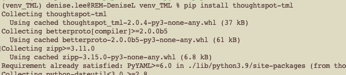

# Process
Export the comments from a Databricks table as a csv. The below image depicts a table, `dl_dataset_facebook`, which includes a few column comments. 

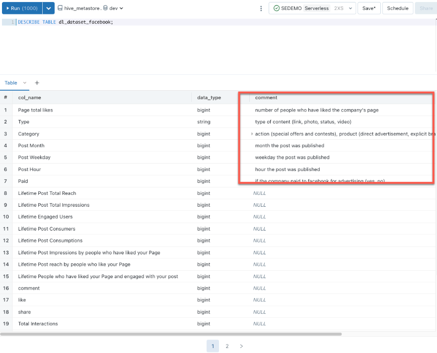

The results can be exported as a CSV file.

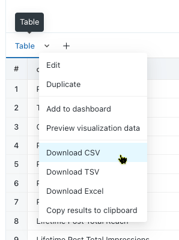

In ThoughtSpot, obtain the connection guid or connection name for your Databricks connection. My connection name is `databricks`.

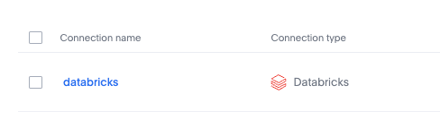

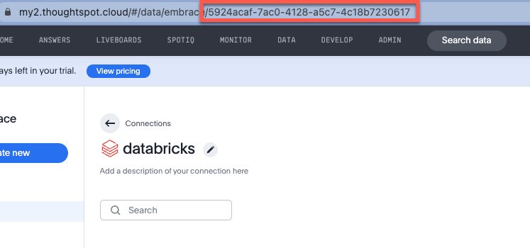

In your IDE, import the following modules. 

```python
from thoughtspot_tml.utils import determine_tml_type
from thoughtspot_tml import Table
from thoughtspot_rest_api_v1 import *
import csv
from typing import List
from thoughtspot_tml import _scriptability
```

Let's set the connection details. We obtained the connection name and guid earlier. The database name, schema, and table are available from Databricks: 

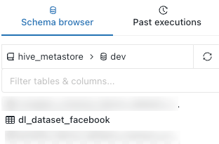

```python
# Connection GUID
connection_guid = '5924acaf-7ac0-4128-a5c7-4c18b7230617'

# Or name
connection_name = 'databricks'

# Databricks source
db_name = "hive_metastore"
schema = 'dev'
db_table = "dl_dataset_facebook"

```

Set the required variables for connecting and authenticating with your ThoughtSpot cluster.

```python
username = 'your thoughtspot user'  
password = 'your password'
server = 'https://yourCluster.cloud/'     

# ThoughtSpot class wraps the V1 REST API
ts: TSRestApiV1 = TSRestApiV1(server_url=server)
try:
    ts.session_login(username=username, password=password)
except requests.exceptions.HTTPError as e:
    print(e)
    print(e.response.content)
```

Get the tml template for a logical table. This template includes everything we need to properly create tml for a table - and we did not need to build it entirely from scratch! To find out more about TML syntax for a table, please see our [documentation](https://docs.thoughtspot.com/cloud/latest/tml-tables#syntax-tables).

```python
tml_cls = determine_tml_type(path='TEMPLATE.table.tml')
tml = tml_cls.load(path='TEMPLATE.table.tml')  
```

Let's tie in our Databricks components, such as database and table name, and prepare to build the tml. We need to map the Databricks BIGINT and STRING datatypes to appropriate formats for ThoughtSpot, and also map the csv fields to the correct tml fields. The function, `create_tml_table_columns_input_file` will read each of the CSV rows and add to the tml object until complete.

```python
#build the top section of the tml file
tml.guid =  None
tml.table.name =db_table
tml.table.db=db_name
tml.table.schema=schema
tml.table.db_table=db_table
tml.table.connection.name=connection_name

tml.table.joins_with = None # setting this so we can avoid a relationship warning

#function for reading in the csv and setting the properties, creating columns
def create_tml_table_columns_input_file(filename: str) -> List[_scriptability.LogicalTableEDocProtoLogicalColumnEDocProto]:
    """Create ThoughtSpot table object columns from a CSV file."""
    thoughtspot_data_converter = {
        "bigint": "INT64",
        "string": "VARCHAR",
    }
    columns = []

    with open(filename) as c:
        reader = csv.DictReader(c, delimiter=',', quotechar='"')

        for row in reader:
            ts_data_type = thoughtspot_data_converter.get(row["data_type"], "VARCHAR")
            
            if ts_data_type == "INT64":
                ts_column_type = "MEASURE"
            else:
                ts_column_type = "ATTRIBUTE"
            
            column = _scriptability.LogicalTableEDocProtoLogicalColumnEDocProto(
                name=row["col_name"],
                description=row["col_desc"],
                db_column_name=row["db_column_name"],
                properties={"index_type": row["index_type"],"column_type": ts_column_type },
                db_column_properties={"data_type": ts_data_type}
            )

            columns.append(column)
         
    return columns
```

Everything is ready and we can now execute the function. Set the file source, provide it to the function, and create the tml. 

```python
if __name__ == "__main__":
    table_csv_input_filename = "column_input.csv"
    columns = create_tml_table_columns_input_file(table_csv_input_filename)

# add the new columns to the table tml
tml.table.columns=columns
```

You can either write the file to disk and import the file using the ThoughtSpot UI, or import the newly created tml using the `metadata_tml_import` function. Let's take a look at both approaches next.

# Using the UI

In this example, we are writing the file to the local filesystem. The file name will be `databricks.table.tml`. 

```python
# Write the file to disk
tml.dump(f'databricks.{tml.tml_type_name}.tml') #name.type.tml
```

Upload the file by accessing the **Import/Export TML** utility, available in the **Data Workspace** under **Data**. 

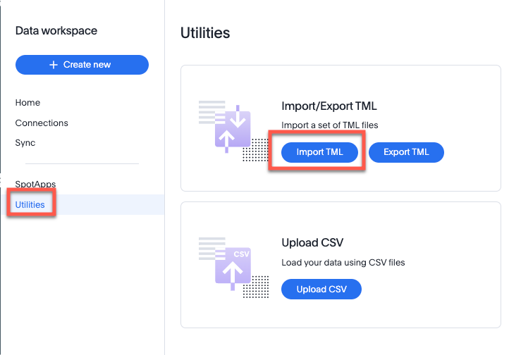

Navigate to the location of your file and select it.

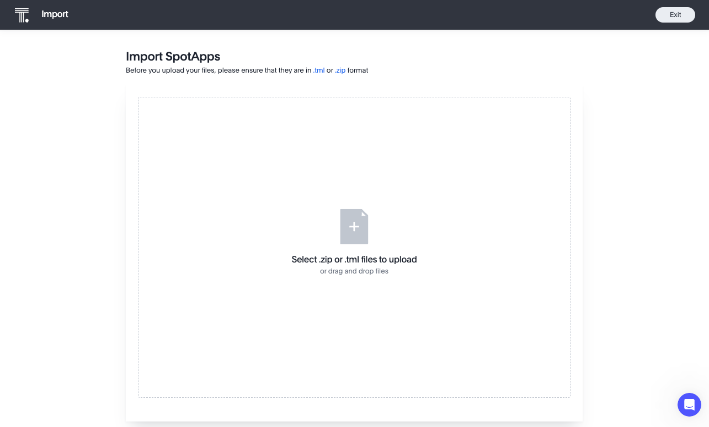

The tool will advance to the next screen. If there are no errors, the status will indicate that the file is ready for import. You can click **View Warnings** if you would like to review any warnings or **Edit** to correct/update items within the file, as needed. Select **Import 1 selected**. 

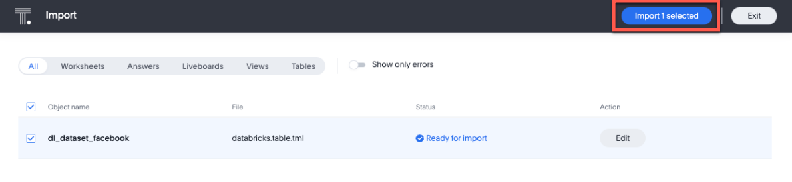

The file was successfully imported. Click **Open** to view the table that was generated in ThoughtSpot, based on this file. 

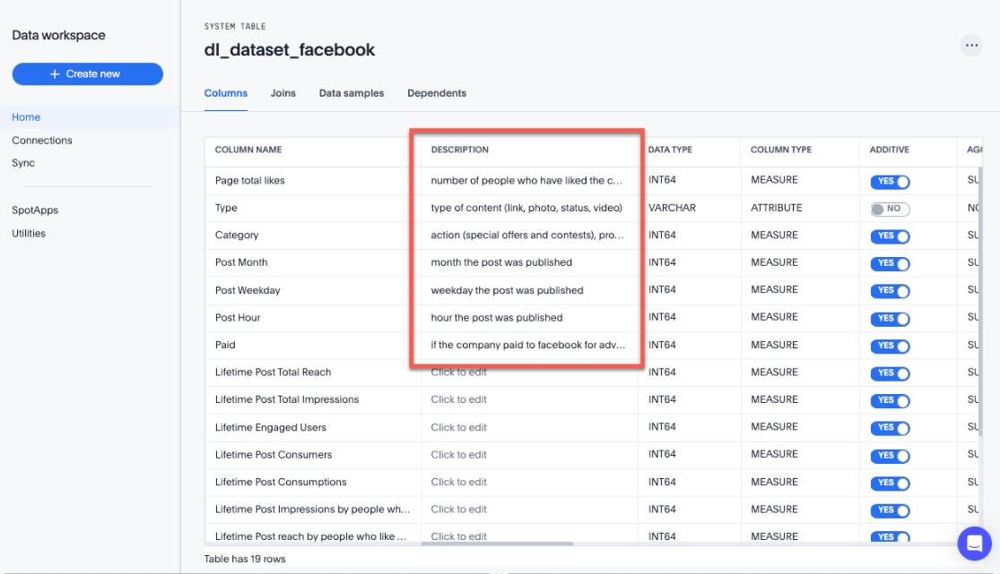

# Using the import endpoint

If you would like to publish to your ThoughtSpot instance right from code, then consider using `metadata_tml_import`.

```python
ts.metadata_tml_import(tml.dumps(format_type="YAML"), create_new_on_server=True, validate_only=False)
```

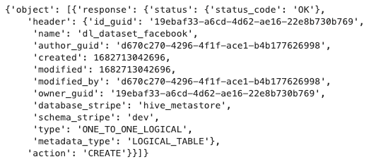


